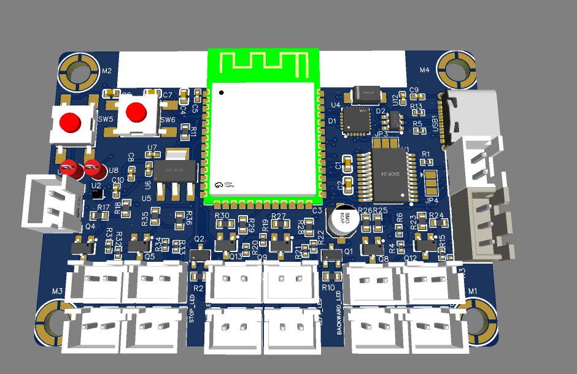
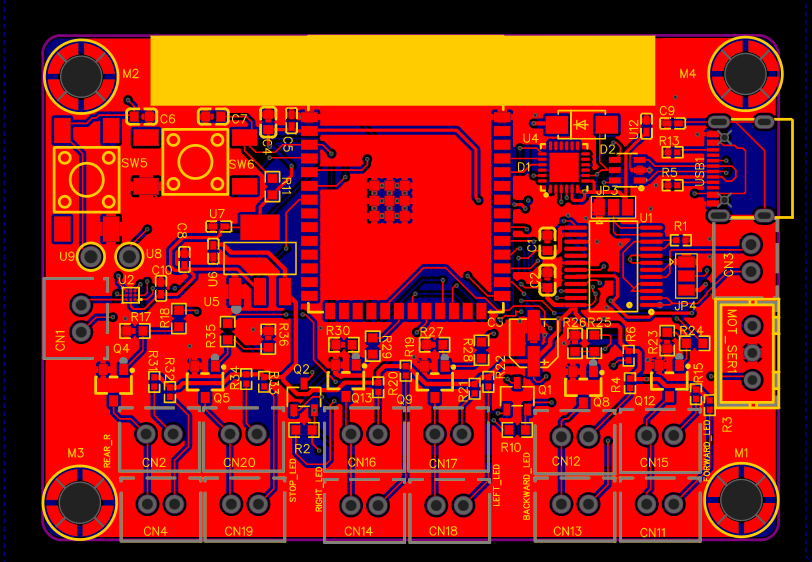
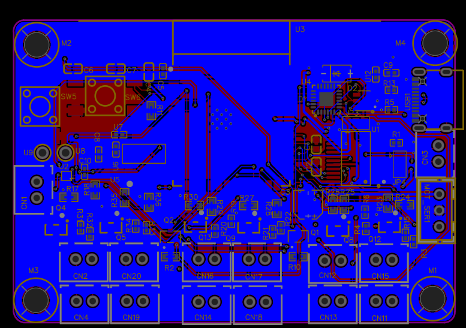
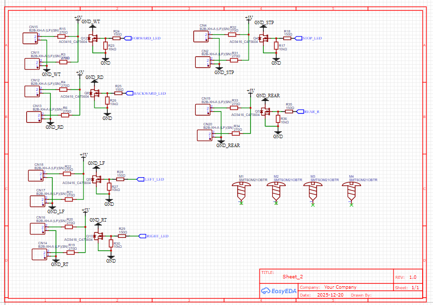

# ESP32-S3 Smart Robot Car Controller

## Description
This project is a feature-rich **All-in-One Robot Controller** based on the **ESP32-S3-WROOM-1** module. It is specifically designed to power smart vehicles and robotics platforms, integrating high-quality audio, dual motor control, and advanced signaling systems into a single compact board.

## Key Features
* **Microcontroller:** ESP32-S3-WROOM-1 with dual-core processing, Wi-Fi, and Bluetooth.
* **Motor Control:** Dual-channel **TB6612FNG** driver capable of controlling two DC motors with high efficiency.
* **Advanced Audio:** Integrated **MAX98357A** I2S Class D amplifier for clear audio and voice feedback.
* **Signaling System:** Dedicated 8-channel LED driver circuit for directional indicators (Turn signals, Brake, etc.).
* **Expandability:** Onboard headers for **Servo Motors** and additional sensor modules.
* **Power & Programming:** USB Type-C interface with a **CP2104** USB-to-Serial converter for seamless firmware updates.

---

## Project Gallery

### 1. 3D Preview

### 2. PCB Layout
#### Top Layer

#### Bottom Layer

### 3. Schematic Design
#### Main System (MCU, Motor Driver & Audio)

#### LED Signaling & Output Stage

---

## Hardware Component List
* **Main MCU:** ESP32-S3-WROOM-1.
* **Motor Driver:** TB6612FNG.
* **Audio Amp:** MAX98357A.
* **USB-Serial:** CP2104.
* **Voltage Regulator:** AMS1117-3.3 for stable logic power.
